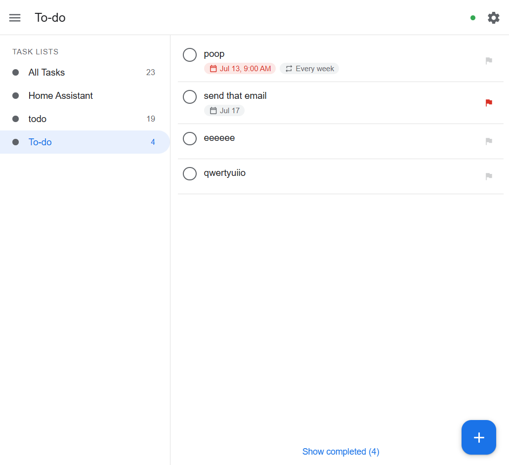
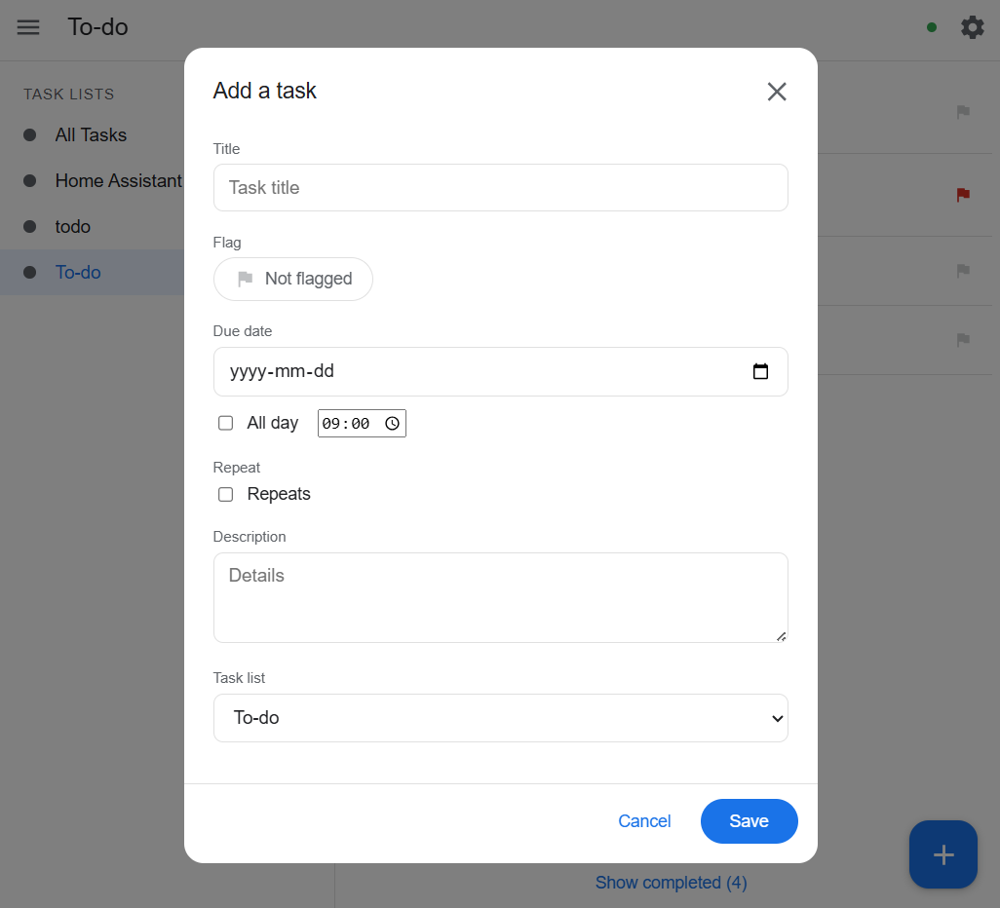
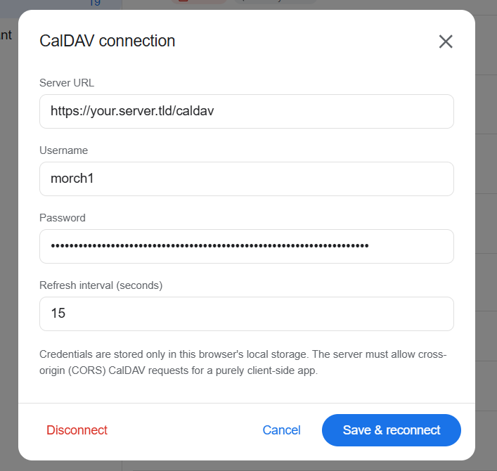

# Tasks — a client-side CalDAV VTODO app

A minimal, Google Tasks–style task manager that talks directly to a CalDAV
server from the browser. No build step, no backend, no dependencies — just
static HTML/CSS/JS and browser storage.

**NOTE:** I made this for my own personal use. Many of the CalDAV VTODO features are not available (task start date, subtasks, etc) simply because I don't need them. This also means that this app is provided as-is, with no guarantee or even expectation that it will fit anyone else's requirements other than my own.

## Screenshots

| Task list | Add a task | CalDAV connection |
|:---:|:---:|:---:|
|  |  |  |

## Features

- **Connection setup** — enter server URL, username, password (stored in this
  browser's `localStorage` only).
- **Collapsible sidebar** listing every calendar collection that holds VTODOs.
  An **All Tasks** entry appears first and aggregates every list.
- **Sorting** — flagged tasks first (by due date), then unflagged tasks (also
  by due date). Tasks with no due date sort last within each group.
- **Task rows** — round completion checkbox on the left, title (bold when
  flagged) with **due-date** and **repeat** badges, and a tappable **flag** on
  the right that toggles the task between flagged and not flagged. Tasks that
  are overdue, or all-day and due today, show a red due-date badge.
- **Add / Edit form** — clicking a task opens it directly for editing, with
  **Save**, **Complete**, and **Delete** (with confirmation) actions. The form
  includes title, flag, due date (all-day or a specific time), repeat rules
  (every *n* days/weeks/months/years, ending never / on a date / after *n*
  occurrences), any number of reminders (at or before the due date, or at a
  specific date/time), description, and target list (defaults to the open list,
  or the last-used list in the All Tasks view). Setting a task's first due date
  adds an at-due reminder by default. Reminders are stored as standard
  iCalendar `VALARM` components.
- **Completed tasks** are hidden behind a **Show/Hide completed** toggle.
- **Live sync** — the server is queried on open and then polled continuously
  (default every 5 s) using `getctag`, with an automatic etag-signature
  fallback for servers that don't support it. Changes made elsewhere appear
  without reloading.
- **Recurring tasks** roll forward to the next occurrence when completed, until
  their `COUNT`/`UNTIL` limit is reached.

## Running

Open `index.html` in a browser (double-click or serve the folder statically),
then click the ⚙ gear to enter your CalDAV connection. Serving over `http(s)`
(e.g. `npx serve .` or `python -m http.server`) is recommended over `file://`.

## Progressive Web App

The app is installable and works offline:

- **`manifest.webmanifest`** — name, colors, and icons (`icons/`), so browsers
  offer an **Install** / **Add to Home Screen** action and launch it in a
  standalone window.
- **`sw.js`** — a service worker that precaches the app shell (HTML/CSS/JS/icons)
  with a stale-while-revalidate strategy. CalDAV requests are never intercepted,
  so live sync is unaffected. The shell loads instantly and offline; task data
  still needs the network to sync.

**Secure-context requirement:** service workers and installation only work over
**HTTPS**, or on **`http://localhost`** / `127.0.0.1`. Over a plain-HTTP LAN
address (e.g. `http://192.168.x.x:8234`) the browser disables the service worker
and won't offer installation — put the app behind TLS for full PWA behavior. The
app itself still runs fine without it.

### Icons

`icons/icon.svg` is the master (a white checkmark on a blue rounded square).
The PNGs (`icon-192/512`, `maskable-192/512`, `apple-touch-icon`, `favicon-32`)
are rendered from it. To regenerate after editing the SVG, use any SVG
rasterizer, e.g. with ImageMagick + librsvg:

```sh
magick -background none icons/icon.svg -resize 512x512 icons/icon-512.png
```

## Running with Docker

The repo ships a tiny nginx-based image that serves the static app. It takes two
environment variables:

| Variable | Default | Meaning |
|----------|---------|---------|
| `BIND_IP` | `0.0.0.0` | IP the server binds to inside the container |
| `PORT`    | `8234`   | Port the server listens on |

Build and run with defaults:

```sh
docker build -t tasklist .
docker run -d --name tasklist -p 8234:8234 tasklist
# open http://localhost:8234
```

Custom IP/port (remember to publish the same container port):

```sh
docker run -d --name tasklist -e BIND_IP=0.0.0.0 -e PORT=9000 -p 9000:9000 tasklist
```

Or with Compose (reads `BIND_IP`/`PORT` from the shell or a `.env` file and
maps the port automatically):

```sh
docker compose up -d --build          # defaults: 0.0.0.0:8234
PORT=9000 docker compose up -d --build # custom port
```

## ⚠️ CORS — read this if the connection fails

Browsers enforce the same-origin policy on `fetch()`. Because this app is
"entirely client-side," it makes CalDAV requests (`PROPFIND`, `REPORT`, `PUT`,
`DELETE`) directly from the page's origin to your server. The **server must
return permissive CORS headers**, or the browser will block the requests:

```
Access-Control-Allow-Origin: <the app's origin>   (or *)
Access-Control-Allow-Methods: GET, PUT, DELETE, PROPFIND, REPORT, OPTIONS
Access-Control-Allow-Headers: Authorization, Depth, Content-Type, If-Match, If-None-Match
Access-Control-Allow-Credentials: true            (if not using *)
```

The server must also answer the preflight `OPTIONS` request for these.

Ways to satisfy this:
- Configure CORS on the CalDAV server (Nextcloud, Baïkal, Radicale, etc.).
- Put a reverse proxy (nginx/Caddy) in front that adds the headers.
- Host this app on the **same origin** as the CalDAV server (no CORS needed).

This is a constraint of the client-only requirement, not of the app logic.

## Flagging

Flagging maps to the iCalendar `PRIORITY` property (RFC 5545). A task reads as
**flagged** whenever `PRIORITY` is set to a non-zero value; toggling the flag on
writes the highest priority (`1`) and toggling it off removes the property. A
priority set elsewhere (e.g. `PRIORITY:5`) still shows as flagged and its value
is preserved on save unless you toggle the flag.

## Files

| File | Purpose |
|------|---------|
| `index.html` | Page shell and modals |
| `css/styles.css` | Google Tasks–like styling, responsive |
| `js/ical.js` | iCalendar VTODO parse/serialize + RRULE helpers |
| `js/caldav.js` | CalDAV protocol (discovery, REPORT, PUT/DELETE, polling) |
| `js/app.js` | UI, state, sorting, live sync |

## Security note

Credentials are kept in `localStorage` in plain text so the app can reconnect
without prompting. Use it only on trusted devices. Click **Disconnect** in
settings to erase them.
